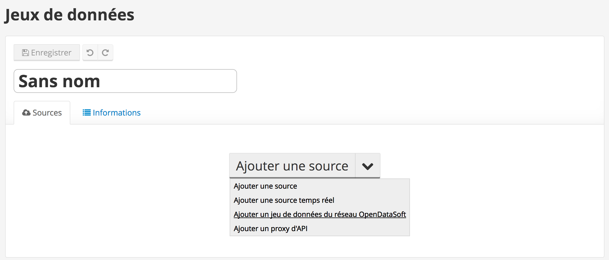
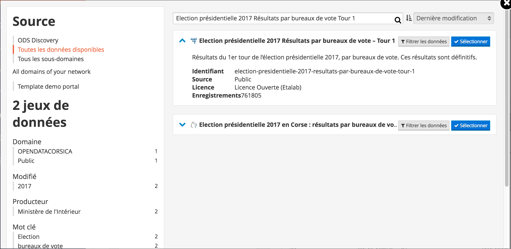
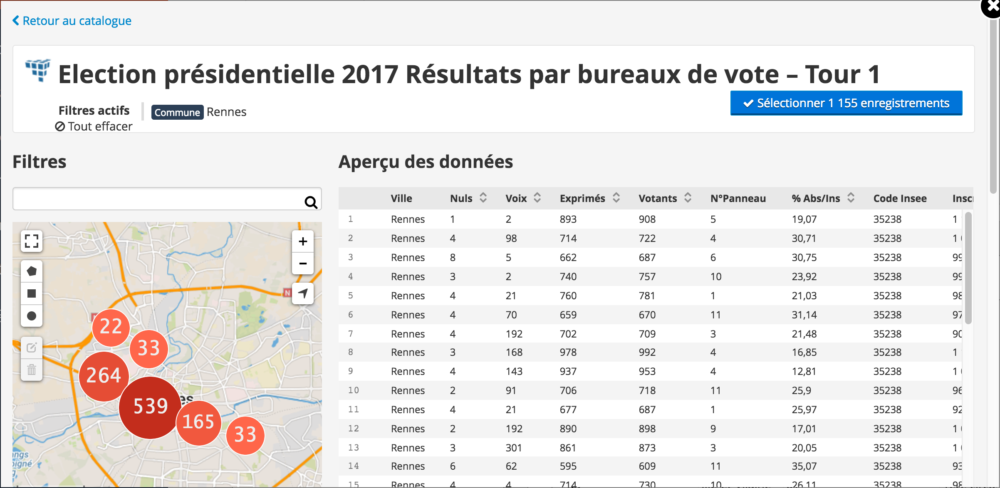
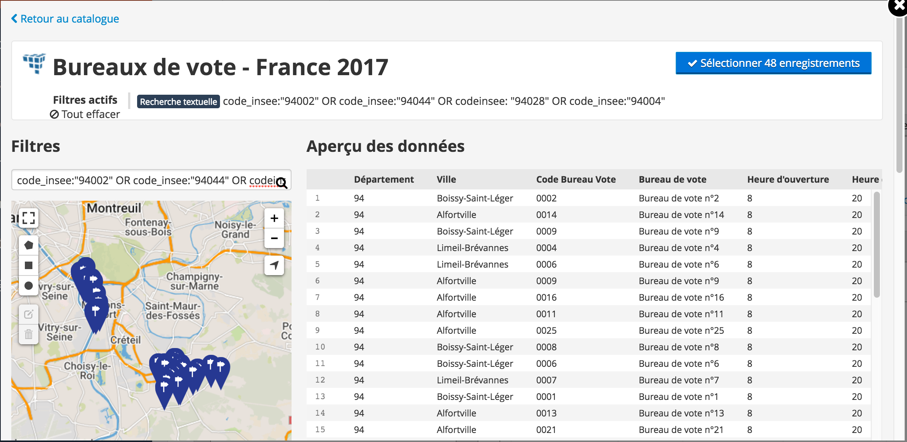
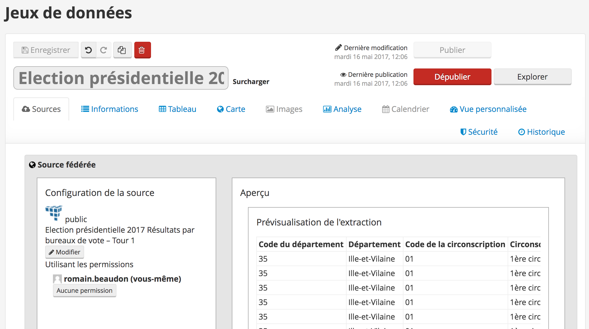
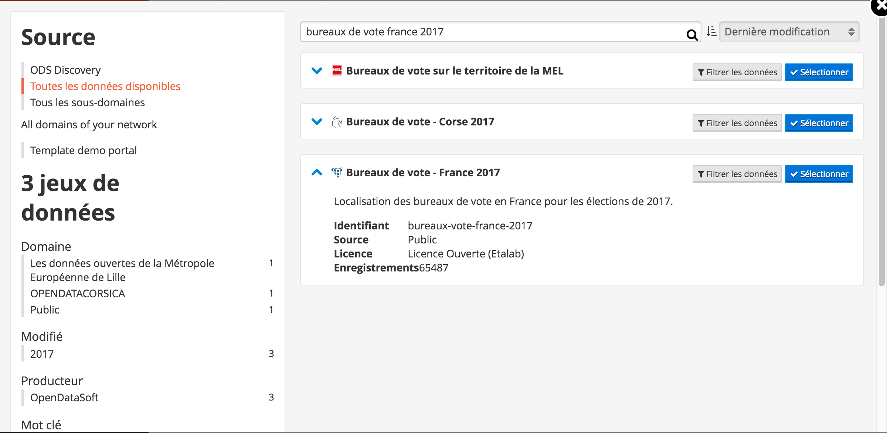

## Election dashboard !

 - [Election dashboard here] (https://discovery.opendatasoft.com/pages/apps-elections-v2/)
 
###How to :
####Federate these 2 datasets on your domain

   * [Results] **Election présidentielle 2017 Résultats par bureaux de vote – Tour 1** (https://data.opendatasoft.com/explore/dataset/election-presidentielle-2017-resultats-par-bureaux-de-vote-tour-1%40public/)

   * [Voting places] **Bureaux de vote - France 2017** (https://data.opendatasoft.com/explore/dataset/bureaux-vote-france-2017%40public/)

####If you don't know how to federate a dataset, please follow the steps below
1. Create a new dataset, and select "Add a dataset from the OpenDataSoft network" in the "Add a Source" button

2. Select the first dataset **Election présidentielle 2017 Résultats par bureaux de vote – Tour 1**

3. Filter this dataset on your city

3b. If you want to include multiple cities, please use a query, e.g. : `code_insee:"94002" OR code_insee:"94044" OR code_insee:"94028"` 

4. Click on select these records, then save and publish the dataset

5. Repeat these steps for the dataset **Bureaux de vote - France 2017**


####Create a new content page and copy paste the code below
#####HTML Tab :
```html
<div class="container-fluid">
    
    <div class="ods-box" >
        <ods-dataset-context context="bureauxdevote,resultatslieu,resultatslieu2"
                             bureauxdevote-dataset="bureaux-de-vote-france-2017"
                             resultatslieu-dataset="election-presidentielle-2017-resultats-par-bureaux-de-vote-tour-1"
                             resultatslieu2-dataset="election-presidentielle-2017-resultats-par-bureaux-de-vote-tour-1"
                             >

            <div class="row ods-box">

                <div class="col-md-7">

                    <h1>
                        Présidentielle 2017 - 1ER tour 
                    </h1>
                    <a href="" ng-click="var.tab.numbureau = ''; resultats.parameters = {}; resultatslieu.parameters = {};">Effacer la sélection</a>
                    <ods-map style="height:600px"
                             scroll-wheel-zoom="false"
                             basemap="jawg.light">
                        <ods-map-layer context="bureauxdevote"
                                       refine-on-click-context="[resultatslieu,resultatslieu2]"
                                       refine-on-click-resultats-map-field="uniq_bdv"
                                       refine-on-click-resultats-context-field="uniq_bdv"
                                       refine-on-click-resultatslieu-map-field="uniq_bdv"
                                       refine-on-click-resultatslieu-context-field="uniq_bdv"
                                       refine-on-click-resultatslieu2-map-field="uniq_bdv"
                                       refine-on-click-resultatslieu2-context-field="uniq_bdv"
                                       refine-on-click-resultats-replace-refine="true"
                                       refine-on-click-resultatslieu-replace-refine="true"
                                       refine-on-click-resultatslieu2-replace-refine="true"
                                       color="#1b6698" 
                                       picto="dot" 
                                       show-marker="false"
                                       size="7">
                        </ods-map-layer>
                    </ods-map>
                </div>

                <div class="col-md-5">

                    <div ng-if="!resultatslieu.parameters['refine.uniq_bdv']">
                        <div class="row">
                            <div class="col-md-12">

                                <div ods-analysis="election"
                                     ods-analysis-context="resultatslieu"

                                     ods-analysis-serie-inscrits="SUM(inscrits)"
                                     ods-analysis-serie-blancs="SUM(blancs)"
                                     ods-analysis-serie-nuls="SUM(nuls)"
                                     ods-analysis-serie-exprimes="SUM(exprimes)"
                                     >

                                    <h2>
                                        Résultats
                                    </h2> 

                                    <div class="participation"><span class="metric_name">Participation</span>
                                        <div class="fond_bar" style="width : 100%"><div class="bar" style="width : {{ election.results[0].exprimes*100/election.results[0].inscrits}}%"><span class="metric_chiffre "> {{ election.results[0].exprimes*100/election.results[0].inscrits | number:0}}%</span></div></div>
                                    </div>
                                    <div class="metrics row">
                                        <div class="metric col-sm-3 col-xs-6">
                                            <span class="metric_chiffre ">{{ election.results[0].inscrits/11 | siPrefixFormat }}</span>
                                            <span class="metric_name">inscrits</span>
                                        </div>
                                        <div class="metric col-sm-3 col-xs-6">
                                            <span class="metric_chiffre ">{{ election.results[0].blancs/11 | siPrefixFormat }}</span>
                                            <span class="metric_name">blancs</span>
                                        </div>
                                        <div class="metric col-sm-3 col-xs-6">
                                            <span class="metric_chiffre ">{{ election.results[0].nuls/11 | siPrefixFormat }}</span>
                                            <span class="metric_name">nuls</span>
                                        </div>
                                        <div class="metric col-sm-3 col-xs-6">
                                            <span class="metric_chiffre ">{{ election.results[0].exprimes/11 | siPrefixFormat }}</span>
                                            <span class="metric_name">exprimés</span>
                                        </div>

                                    </div>   

                                </div>
                            </div>

                            <div class="col-md-12">


                                <div class="col-md-12">
                                    <div ods-analysis="candidat"
                                         ods-analysis-context="resultatslieu"
                                         ods-analysis-x="nom"
                                         ods-analysis-serie-voix="SUM(voix)"
                                         ods-analysis-serie-exprimes="SUM(exprimes)"
                                         ods-analysis-sort="voix"

                                         >
                                        <div ng-repeat="(i, result) in candidat.results">
                                            <div class="candidat">
                                                <span class="name">{{result.x}}</span> :<span class="result"> <span class="voix">{{ result.voix | number }} voix </span>/<span class="pourcent"> {{ result.voix*100/result.exprimes | number}}%</span></span>

                                                <div class="fond_bar" style="width : 100%"> <div class="bar" style="width : {{ result.voix*100/result.exprimes}}%"></div>
                                                </div>
                                            </div>   
                                        </div>      
                                    </div>

                                </div>

                            </div>


                        </div>
                        <div class="alert">Cliquez sur un lieu de vote pour afficher les résultats de celui-ci !</div>
                    </div>

                    <div ng-if="resultatslieu.parameters['refine.uniq_bdv']">
                        <ods-result-enumerator context="resultatslieu" max="1" show-pagination="false">
                            <h2>
                                Lieu de vote : {{item.fields.nom_bureau_vote}} - {{item.fields.ville}}
                            </h2> 
                        </ods-result-enumerator>

                        <div ods-analysis="resultatsbureau"
                             ods-analysis-context="resultatslieu"
                             ods-analysis-serie-inscrits="SUM(inscrits)"
                             ods-analysis-serie-blancs="SUM(blancs)"
                             ods-analysis-serie-nuls="SUM(nuls)"
                             ods-analysis-serie-exprimes="SUM(exprimes)"
                             >
                                <div class="participation"><span class="metric_name">Participation</span>
                                    <div class="fond_bar" style="width : 100%"><div class="bar" style="width : {{ resultatsbureau.results[0].exprimes*100/resultatsbureau.results[0].inscrits}}%"><span class="metric_chiffre "> {{ resultatsbureau.results[0].exprimes*100/resultatsbureau.results[0].inscrits | number}}%</span></div></div>
                                </div>
                                <div class="metrics row">
                                    <div class="metric col-sm-3 col-xs-6">
                                        <span class="metric_chiffre ">{{ resultatsbureau.results[0].inscrits/11 | number }}</span>
                                        <span class="metric_name">inscrits</span>
                                    </div>
                                    <div class="metric col-sm-3 col-xs-6">
                                        <span class="metric_chiffre ">{{ resultatsbureau.results[0].blancs/11 | number }}</span>
                                        <span class="metric_name">blancs</span>
                                    </div>
                                    <div class="metric col-sm-3 col-xs-6">
                                        <span class="metric_chiffre ">{{ resultatsbureau.results[0].nuls/11 | number }}</span>
                                        <span class="metric_name">nuls</span>
                                    </div>
                                    <div class="metric col-sm-3 col-xs-6">
                                        <span class="metric_chiffre ">{{ resultatsbureau.results[0].exprimes/11 | number }}</span>
                                        <span class="metric_name">exprimés</span>
                                    </div>

                                </div>   

                        </div>
                        <div class="col-md-12">
                            <div ods-analysis="candidat"
                                 ods-analysis-context="resultatslieu"
                                 ods-analysis-x="nom"
                                 ods-analysis-serie-voix="SUM(voix)"
                                 ods-analysis-serie-exprimes="SUM(exprimes)"
                                 ods-analysis-sort="voix"

                                 >
                                <div ng-repeat="(i, result) in candidat.results">
                                    <div class="candidat">
                                        <span class="name">{{result.x}}</span> :<span class="result"> <span class="voix">{{ result.voix | number }} voix </span>/<span class="pourcent"> {{ result.voix*100/result.exprimes | number}}%</span></span>

                                        <div class="fond_bar" style="width : 100%"> <div class="bar" style="width : {{ result.voix*100/result.exprimes}}%"></div>
                                        </div>
                                    </div>   
                                </div>      
                            </div>

                        </div>

                        <div class="alert">Sélectionnez un bureau de vote ci-dessous pour afficher les résultats pour celui-ci !</div>
                    </div>

                </div>
            </div>
            <div class="row ods-box">
                <div class="col-md-12" ng-init="var = {}; var.tab={'numbureau':''}">
                    <div ng-if="resultatslieu.parameters['refine.uniq_bdv']">
                        <div ods-results="items" ods-results-max="121" ods-results-context="resultatslieu">
                            <ul class="items tab-links">
                                <li ng-repeat="item in items"
                                    class="item ods-button ods-button--primary" ng-class="{'ods-button--custom': var.tab.numbureau == item.fields.code_du_b_vote}" 
                                    ng-click="var.tab.numbureau=item.fields.code_du_b_vote; resultatslieu2.parameters['refine.code_du_b_vote'] = item.fields.code_du_b_vote" ng-if="$index % 11 === 0">
                                    <span>
                                        Bureau N° {{ item.fields.code_du_b_vote }}
                                    </span>
                                </li>
                            </ul>

                            <div class="col-md-12">
                                <div ng-if="var.tab.numbureau == resultatslieu2.parameters['refine.code_du_b_vote']" class="row" ng-class="item.fields.code_du_b_vote">
                                    <div class="col-md-6">
                                        <div ods-analysis="election"
                                             ods-analysis-context="resultatslieu2"

                                             ods-analysis-serie-inscrits="SUM(inscrits)"
                                             ods-analysis-serie-blancs="SUM(blancs)"
                                             ods-analysis-serie-nuls="SUM(nuls)"
                                             ods-analysis-serie-exprimes="SUM(exprimes)"
                                             >
                                            <div class="participation"><span class="metric_name">Participation</span>
                                                <div class="fond_bar" style="width : 100%"><div class="bar" style="width : {{ election.results[0].exprimes*100/election.results[0].inscrits}}%"><span class="metric_chiffre "> {{ election.results[0].exprimes*100/election.results[0].inscrits | number}}%</span></div></div>
                                            </div>
                                            <div class="metrics row">
                                                <div class="metric col-sm-3 col-xs-6">
                                                    <span class="metric_chiffre ">{{ election.results[0].inscrits/11 | number }}</span>
                                                    <span class="metric_name">inscrits</span>
                                                </div>
                                                <div class="metric col-sm-3 col-xs-6">
                                                    <span class="metric_chiffre ">{{ election.results[0].blancs/11 | number }}</span>
                                                    <span class="metric_name">blancs</span>
                                                </div>
                                                <div class="metric col-sm-3 col-xs-6">
                                                    <span class="metric_chiffre ">{{ election.results[0].nuls/11 | number }}</span>
                                                    <span class="metric_name">nuls</span>
                                                </div>
                                                <div class="metric col-sm-3 col-xs-6">
                                                    <span class="metric_chiffre ">{{ election.results[0].exprimes/11 | number }}</span>
                                                    <span class="metric_name">exprimés</span>
                                                </div>

                                            </div>   

                                        </div>
                                    </div>
                                    <div class="col-md-6">
                                        <div ods-analysis="candidat"
                                             ods-analysis-context="resultatslieu2"
                                             ods-analysis-x="nom"
                                             ods-analysis-serie-voix="SUM(voix)"
                                             ods-analysis-serie-exprimes="SUM(exprimes)"
                                             ods-analysis-sort="voix"

                                             >
                                            <div ng-repeat="(i, result) in candidat.results">
                                                <div class="candidat">
                                                    <span class="name">{{result.x}}</span> :<span class="result"> <span class="voix">{{ result.voix | number }} voix </span>/<span class="pourcent"> {{ result.voix*100/result.exprimes | number}}%</span></span>

                                                    <div class="fond_bar" style="width : 100%"> <div class="bar" style="width : {{ result.voix*100/result.exprimes}}%"></div>
                                                    </div>
                                                </div>   
                                            </div>      
                                        </div>
                                    </div>
                                </div>
                            </div>
                        </div>

                    </div>
                </div>

            </div>
            
            </ods-dataset-context>
    </div>
</div>

<div class="external-links">
    <a class="external-links__link" href="https://github.com/opendatasoft/ods-cookbook/tree/master/dashboard/elections-v2" target="_blank">Voir le code sur github <i class="fa fa-external-link"></i></a>
</div>
```

```css
.remove-filter {
    position: absolute;
    top: 62px;
    left: 70px;
    right: 20px;
    width: 203px;
    border: 2px solid black;
    padding: 2px 15px;
    background: rgba(30, 12, 51, 0.38);
    color: white;
    font-weight: 300;
    font-style: italic;
    font-size: 1.2em;
}
.bureau_title {
    text-align:center;
    font-size: 1.4em;
    margin-top: 10px;
}
.metrics {
    border-radius: 3px;
    text-align: center;
}
.metric {
    padding: 2px 5px;
    text-align: center;
    font-size: 1.2em;
    font-weight: 600;
    line-height: 1em;
    display: inline-block;
    float : left;
    margin-bottom : 30px
}
span.metric_name {
    display: block;
    font-size: 0.8em;
    font-weight: 600;
    font-family: "archive", verdana;
    border-bottom : 1px solid #E6174E;
    padding : 1px;

}
span.metric_chiffre {
    font-weight: 600;
    color: #E6174E;
    font-size : 1.2em;
    font-family: "archive", verdana;
}
div.fond_bar{
    background-color : #cecece;

    height : 5px;

}
div.bar{
    background-color : #000;
    height : 5px;
}
.participation div.fond_bar{
    background-color : #cecece;
    height : 25px;
    border-radius : 2px;

}
.participation {
    margin-bottom : 10px;
}
.participation div.bar{
    background-color : #E6174E;
    height : 25px;
    border-radius : 2px 0 0 2px;
}
span.name{
    margin-top : 20px;

    font-family: "archive", verdana;
}
span.result{
    float : right ;
    color : #000;
    font-weight : bold;
    font-size : 1.0em;
}
.bloc_bureau{
    min-height: 485px;
}
.candidat{
    padding-bottom : 7px;
    line-height: 1.1em;
}
adress {
    font-weight: 600;
    width: 300px;
    height: 80px;
    display: inline-block;
    background: url("/assets/theme_image/geoloc.png") no-repeat;
    text-indent : 60px;
}

ul.tab-links{
    padding-left : 0px !important;
    margin-left : 0px !important;

}
ul.tab-links li{
    margin : 0px !important;

}
.ods-button--primary {
    background-color : #cecece;
    border : 1px solid #fff;
    border-bottom : none;
    color : #000000;
    border-radius : 3px 3px 0 0;
}
.ods-button--custom {
    background-color: #1e0c33;
    color: white;
}

.participation .metric_chiffre{
    color : #fff; float : right;padding-right : 5px;font-weight : normal !important;
}
.participation .metric_name{
    text-align : left;
}

.bureau {
    border : 1px solid  rgba(0,0,0,0.15);
    border-radius: 3px;

}
h2 {
    margin-top: 0;
}

.pourcent { 
    color: #E6174E; 
    font-weight : 1.2em;
}

.alert{
    margin-top : 20px;
    height: 66px;
    display: inline-block;
    background: url("/assets/theme_image/fleche.png") 5px 18px no-repeat ;
    font-family: "archive", verdana;

    background-color : #f5f5f5;
    padding :7px  17px;

}
.alert_bis{
    margin-top : 20px;
    height: 66px;
    display: inline-block;
    background: url("/assets/theme_image/fleche_bis.png") 15px 2px no-repeat ;
    font-family: "archive", verdana;

    background-color : #f5f5f5;
    padding :7px  17px;

}
.alert div, .alert_bis div {padding-left : 88px; padding-top : 7px; }
```