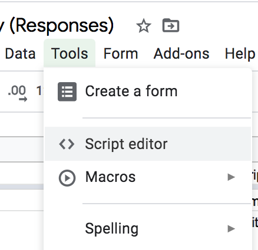
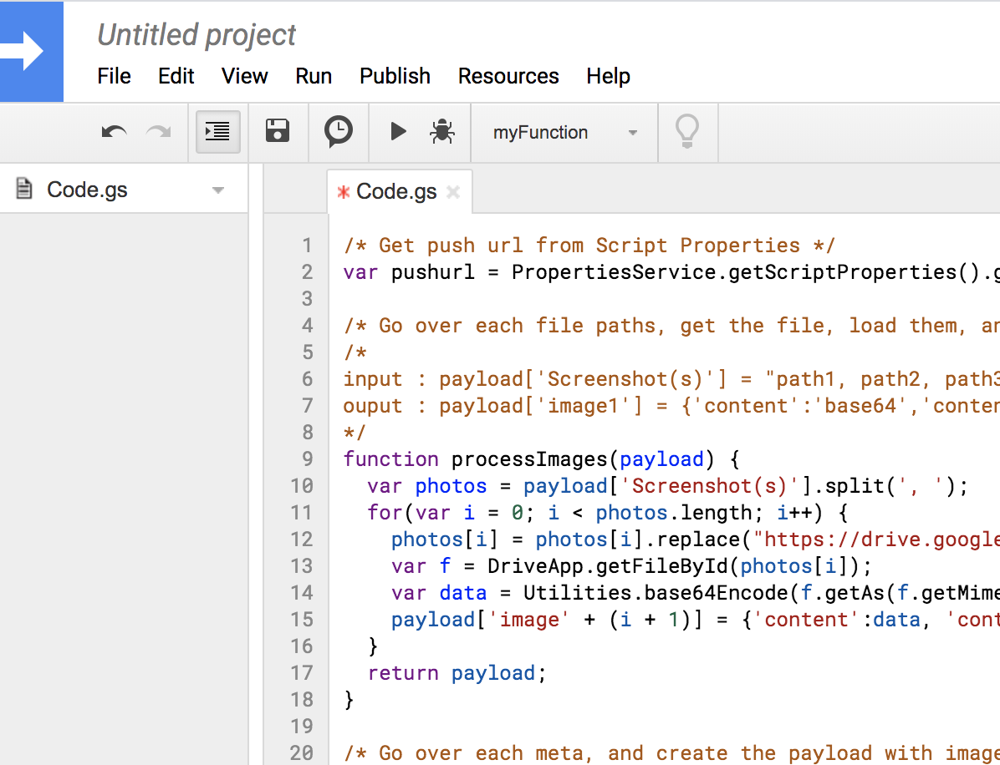
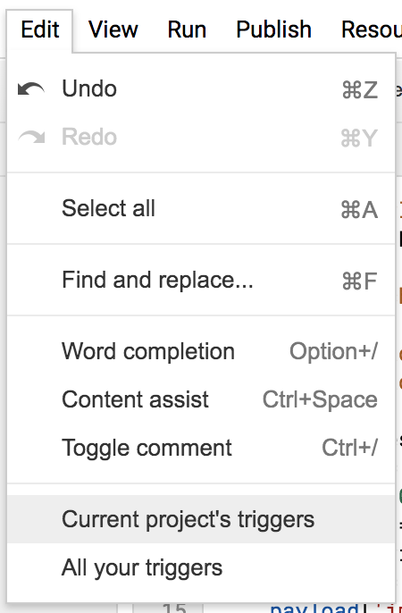
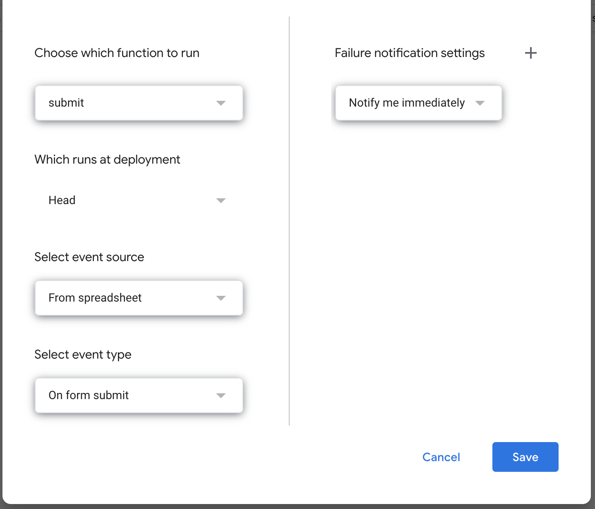
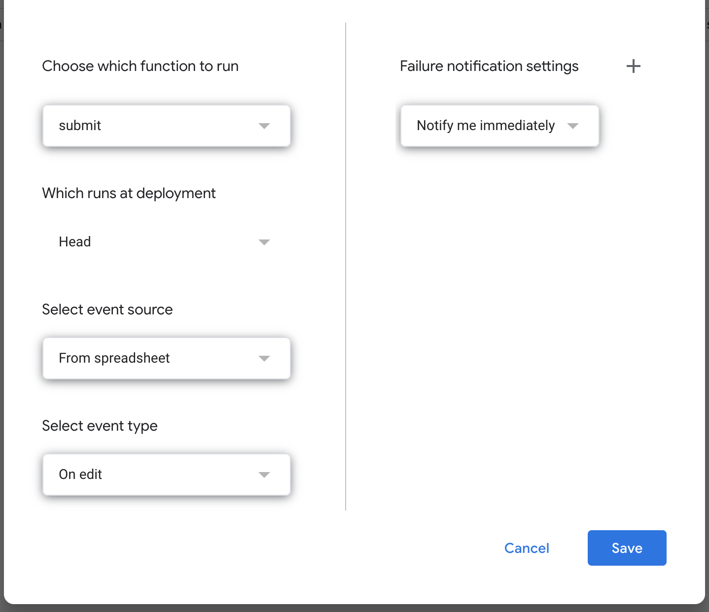
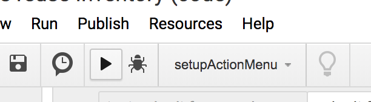
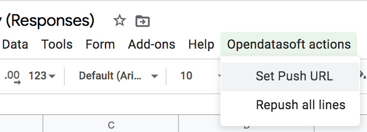
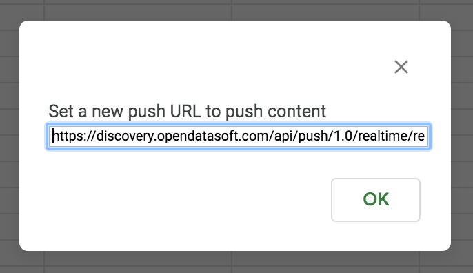

# The Survey/Spreadsheet Push API scenario! 

The guide is an advanced version of [the basic scenario that you'll find here](/opendatasoft/ods-cookbook/tree/master/dashboard/survey-spreadsheet-scenario).
Please read carefully the first version as you'll need to proceed from step 1 to 10 before starting this version of the setup.

**The different steps explained :**
    
- A form will help users to fill in the requested information or data
- This form will automatically fill a spreadsheet with all the answers
- A Google App trigger will execute a script that will put the new submit to the Push API

Simply :)

**Other feature and benefits :**

- If an edit is detected on an existing row, a script is executed to push the row to the Push API 
- An action menu is available on your spreadsheet to change the Push API URL, but also to reprocess (push) the entire document

- The spreadsheet can remain private, as the data is pushed to the API directly

**Prerequisites :**
 
- Don't forget to ask ODS to activate Realtime push API
- And also the File type selector in publish page if you intend to push files
 
 
## How to :

#### Create a form, setup the triggers

Follow steps 1 to 10 of this guide [The Survey/Spreadsheet export scenario](/opendatasoft/ods-cookbook/tree/master/dashboard/survey-spreadsheet-scenario).

Then 

1. You'll open the Google Script editor: Tools -> Script editor

1. Paste all the script code into your code editor, you can [find the code here](script.gs), then save !

1. It's now time to set up the triggers ! Go to Edit -> Current project's trigger

1. Setup the first trigger, the On Form Submit ! Bind the submit function to your spreadsheet as follow

1. Setup the second trigger, the On Edit ! As follow

1. Go back to the code editor, in the list menu, select `setupActionMenu` function and press Play icon to execute. It will add an action menu to your spreadsheet
 

1. Setup your dataset on the platform, create a push API source, save it and get the Push URL. [More documentation here](https://help.opendatasoft.com/platform/en/publishing_data/03_scheduling_updates/scheduling_updates.html#pushing-real-time-data)

1. Go back to your spreadsheet, in the ODS action menu, set the push URL

#### Time to check and adapt the code :

Your scenario is now set up, everything is linked and ready to push. 

But we still need to adapt some lines of code depending on your usecase and your schema.

**Things to know :**

- `submit` function is the main function
- it calls `processNamedValues` and `processRange` depending on the event : onForm or onEdit
- both will process the row, and then process the attached images
- If you don't have images in your form, then **comment lines 28 and 49**
- If you do have images, then `processImages` is the function you will need to adapt
- line 10 refer to the name of the column/field of the form. In the exemple `Screenshot(s)`
- replace it by yours, (hint: to get the correct name, copy paste it from the spreadsheet column title)

Congratulation ! You have your first push-api-crowdsourced-ready setup running !

- You can now submit some tests, wait, and see how your new submits are processed and published automatically on your OpenDataSoft platform!
