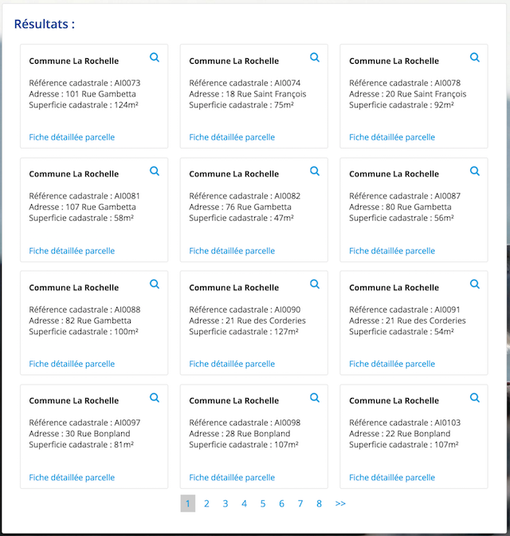

### Display result as card boxes instead on table lines

Instead of an old style table line result, it's possible to iterate onver result and display elements as card boxes.

Ods-result-enumerator is used to get the number of result, iterate over entries, and deal with page managment.

#### Code 

```html
<div class="row">
    <div class="ods-box results">
        <h2>
            Résultats :
        </h2>
        <ods-result-enumerator show-pagination="true" max="12" context="context">
            <div class="col-md-6 col-lg-4">
                <div class="ods-box result">
                    <h4>Commune {{item.fields.commune}}</h4>
                    <p ng-bind-html="item.fields.parcelle | safenewlines">
                    </p>
                    <a class="result--loupe" ng-click="context.parameters['q'] = '\'' + item.fields.identifiant_parcelle + '\''" href="#"><i class="fa fa-search" aria-hidden="true"></i></a>
                    <a class="result--link" target="_blank"
                       ng-href="https://cdalarochelle.opendatasoft.com/page/exportplu/?q=identifiant_parcelle:%22{{item.fields.identifiant_parcelle}}%22">
                        Fiche détaillée parcelle
                    </a>
                </div>
            </div>
        </ods-result-enumerator>
    </div>
</div>	
```

```css
.results {
    min-height: 250px;
}
.result {
    height:180px;
    padding: 15px;
    padding-top: 0px;
    margin-bottom: 15px;
}
.result--link {
    position: absolute;
    bottom: 25px;
}

.result--loupe {
    position: absolute;
    top: 10px;
    right: 25px;
    font-size: large;
}
```

#### Result

