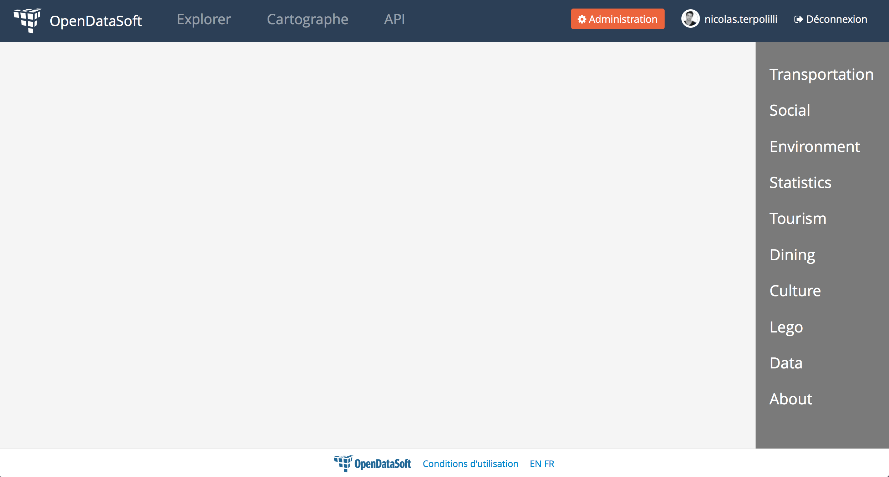

### How to add a menu on the right of a dashboard

Code to add a slightly transparent menu, fixed on the right of the dashboard.

Demo :



CSS code :

```css
footer {
    z-index: 2;
    width: 100%;
    position: fixed;
}

#rmenu {
    position:fixed;
    width: 15%;
    right: 0;
    top: 60px;
    bottom: 40px;
    height: 100%;    
    background: rgba(0,0,0, 0.5);
    color: #fff;
    font-size: 1.7vw;
    text-align: left;
    min-width: 80px;
}

li {
    list-style-type: none;
    margin-bottom: 1em;
}

#rmenu > ul {
    padding-left:20px;
    margin: 30px 0;
}

#rmenu > ul > li > a {
    color: #fff;
}

#rmenu > ul > li > a:hover {
    color: #1b6698;
    text-decoration: none;
}
```

HTML code :

```html
<div id="page-layout-single-main" class="container">
    <div class="row">
        <div>
            <!-- Content -->
        </div>
        <div id="rmenu">
            <ul>
                <li><a href="#">Transportation</a></li>
                <li><a href="#">Social</a></li>
                <li><a href="#">Environment</a></li>
                <li><a href="#">Statistics</a></li>
                <li><a href="#">Tourism</a></li>
                <li><a href="#">Dining</a></li>
                <li><a href="#">Culture</a></li>
                <li><a href="#">Lego</a></li>
                <li><a href="#">Data</a></li>
                <li><a href="#">About</a></li>
            </ul>
        </div>
    </div>
</div>
```