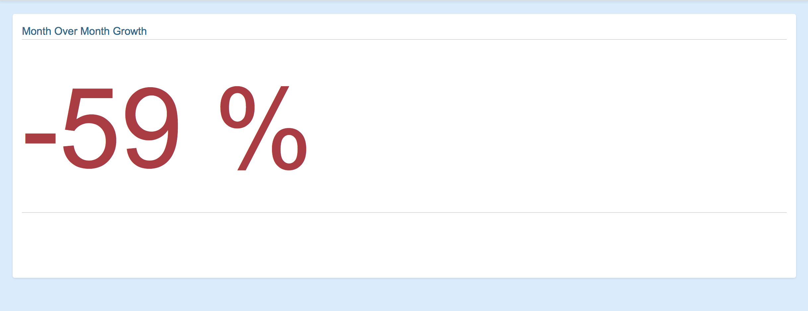

### Display a metric color depending on its value

Consider a dataset showing an evolution over time. We would like to display the growth percentage, for exemple month over month. We also want to change the color depending on the range.

- Red if the value is lower than 0%
- Orange if the value is between 0% and 20%
- Green if the value is greater than 20%

Since we want to always calculate the growth between the last two months, we can start by defining a new variable with the last_two values:

```javascript
	{{ last_two=(analysis.results|limitTo:-2);"" }}
```

We can then display the calculated growth

```html
	<div class="whitebox">
	    <ods-dataset-context context="entreprisesimmatriculees2015infogreffe" 
	                         entreprisesimmatriculees2015infogreffe-dataset="entreprises-immatriculees-2015@infogreffe" 
	                         entreprisesimmatriculees2015infogreffe-parameters="{'disjunctive.ville':true,'disjunctive.	code_postal':true,'disjunctive.date':true,'q':'date>30/08/2015'}">
	        <div ods-analysis="analysis" 
	             ods-analysis-context="entreprisesimmatriculees2015infogreffe" 
	             ods-analysis-x-month="date.month" 
	             ods-analysis-x-year="date.year" 
	             ods-analysis-serie-immat="COUNT()">
	            	<h3>Month Over Month Growth</h3>
	            	{{ last_two=(analysis.results|limitTo:-2);"" }}
					<h3>
	    			    {{ (last_two[1].immat - last_two[0].immat)*100/last_two[0].immat | number:0}} %
	    			</h3>
	    		</div>
	        </div>
	    </ods-dataset-context>
	</div>
```

Then we just need to add a condition with `ng-if` on the value, give the `h3`s an id and add some CSS :

```html
	<div class="whitebox">
	    <ods-dataset-context context="entreprisesimmatriculees2015infogreffe" 
	                         entreprisesimmatriculees2015infogreffe-dataset="entreprises-immatriculees-2015@infogreffe" 
	                         entreprisesimmatriculees2015infogreffe-parameters="{'disjunctive.ville':true,'disjunctive.	code_postal':true,'disjunctive.date':true,'q':'date>30/07/2015'}">
	        <div ods-analysis="analysis" 
	             ods-analysis-context="entreprisesimmatriculees2015infogreffe" 
	             ods-analysis-x-month="date.month" 
	             ods-analysis-x-year="date.year" 
	             ods-analysis-serie-immat="COUNT()">
	            <h3>Month Over Month Growth</h3>
	            {{ last_two=(analysis.results|limitTo:-2);"" }}
	            <div class="nb">
	                <h3 ng-if="(last_two[1].immat - last_two[0].immat)*100/last_two[0].immat > 0 && (last_two[1].immat - 	last_two[0].immat)*100/last_two[0].immat < 20" id="mom_pos">
	                    {{ (last_two[1].immat - last_two[0].immat)*100/last_two[0].immat | number:0}} %
	                </h3>
	                <h3 ng-if="(last_two[1].immat - last_two[0].immat)*100/last_two[0].immat < 0" id="mom_neg">
	                    {{ (last_two[1].immat - last_two[0].immat)*100/last_two[0].immat | number:0}} %
	                </h3>
	                <h3 ng-if="(last_two[1].immat - last_two[0].immat)*100/last_two[0].immat > 20" id="mom_good">
	                    {{ (last_two[1].immat - last_two[0].immat)*100/last_two[0].immat | number:0}} %
	                </h3>
	            </div>
	        </div>
	    </ods-dataset-context>
	</div>
```

And the CSS :

```css
#mom_neg {
    font-size: 12rem;
    color: #aa3c44;
}

#mom_pos {
    font-size: 12rem;
    color: #e8af55;
}

#mom_good {
    font-size: 12rem;
    color: #4f8f55;
}
```

And here's the result:


