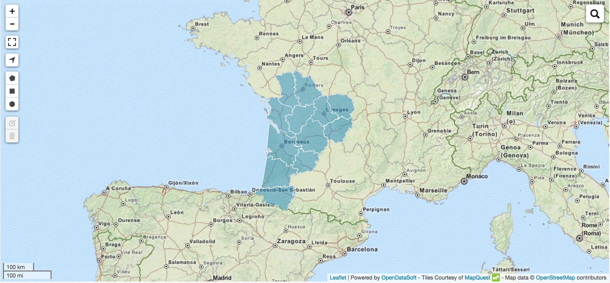

### Create an ods-map with different layer of administrative level and navigate through them

We would like to display the first administrative level of a country, for e.g., an then on clic display the sub-level.

```html
	<div class="container-fluid">
	    <div class="map">
	        <ods-dataset-context context="regions,depts,comm" 
	                             regions-dataset="contours-geographiques-des-nouvelles-regions-metropole"
	                             depts-dataset="geoflar-departements-2015"
	                             comm-dataset="geoflar-communes-2015">
	            <ods-map>
	                <ods-map-layer context="regions"
	                               refine-on-click-context="[regions,depts]"
	                               refine-on-click-regions-map-field="new_code"
	                               refine-on-click-regions-context-field="new_code"
	                               refine-on-click-depts-map-field="new_code"
	                               refine-on-click-depts-context-field="code_reg"  
	                               color="#2b8cbe"
	                               show-if="!regions.parameters['refine.new_code']">
	                </ods-map-layer>
	                <ods-map-layer context="depts"
	                               refine-on-click-context="[depts,comm]"
	                               refine-on-click-depts-map-field="code_dept"
	                               refine-on-click-depts-context-field="code_dept" 
	                               refine-on-click-comm-map-field="code_dept"
	                               refine-on-click-comm-context-field="code_dept"
	                               color="#2b8cbe"
	                               show-if="depts.parameters['refine.code_reg'] && !comm.parameters['refine.code_dept']">
	                </ods-map-layer>
	                <ods-map-layer context="comm"
	                               show-if="comm.parameters['refine.code_dept']"
	                               display="raw"
	                               color-ranges="#ece7f2;500;#a6bddb;3500;#2b8cbe" 
	                               color-by-field="population">
	                </ods-map-layer>
	            </ods-map>
	        </ods-dataset-context>
	    </div>
	</div>
```
First level:


Second level:


Third level:
