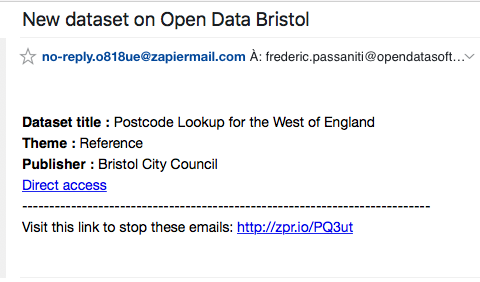

### "Alert me if new datasets are publish for a specific search or a specific theme !" 

Go to your favorite OpenDataSoft portal, for exemple [Data](https://data.opendatasoft.com/).

Then go to the catalog, and make your search by entering a textual query or simply apply some filter.

In this example, I'll focus on datasets :
 - in english by filtering on Language filter and clicking on English.
 - with a description or title containing the word "world"
 
The URL should looks like that:
`
https://data.opendatasoft.com/explore/?sort=modified&refine.language=en&q=World
`

It contains several things :
 - **q =** world (the query)
 - **refine.language =** en (the filter on language property)
 - **sort =** modified (last modified or created datasets first)
 
Now that we are fine with this selection, it's time to get the corresponding API URL to provide to Zapier a direct access to the list of datasets through the Json API.

Let's go to the [API V2 Console] (https://data.opendatasoft.com/api/v2/console)
Go to the Catalog section, /{source}/datasets endpoint, and start to fill the form :

- **where :** language = 'en'
- **search :** world
- **sort :** -modified

Try it out!

The API call that Zapier will need is displayed in the **Request URL** bloc

`
https://data.opendatasoft.com/api/v2/catalog/datasets?where=language%20%3D%20'en'&search=world&rows=10&sort=-modified&pretty=false&timezone=UTC&include_app_metas=false
`

Just before going to Zapier, please also have a look to the API output. 
It's Json output, containing a main object, with the `datasets` object containing the list of datasets.
Each dataset has it's own `dataset` object that contain an unique identifier `dataset_id`
These object keys are important for the Zapier configuration to define where is the list of entries, and what defines the unique ID of each entries.

```json
{
  "total_count": 368,
  "links": [],
  "datasets": [
    {
      "links": [],
      "dataset": {
        "dataset_id": "continents-of-the-world-merged@public",
        "dataset_uid": "da_f61b12",
        "attachments": [],
        "has_records": true,
        "data_visible": true,
        "fields": [],
        "metas": {},
        "features": []
      }
    },
    {
      "links": [],
      "dataset": {
        "dataset_id": "saudi-arabia-real-effective-exchange-rate-index-1980-2014@kapsarc",
        "dataset_uid": "da_zjexhi",
        "attachments": [],
        "has_records": true,
        "data_visible": true,
        "fields": [],
        "metas": {},
        "features": []
      }
    },
    ...
```


We can now go to Zapier and create a Zap ! 
A zap is a workflow containing a trigger (the call to the API) and an action (the event to do when something occurs)

- Go to your [Zapier dashboard](https://zapier.com/app/dashboard) 
- MAKE A ZAP!
- Search and pick "Webhooks by Zapier"
- Select "Retrieve Poll" trigger
- Then fill the form :
  - URL : the API URL (`https://data.opendatasoft.com/api/v2/catalog/datasets?where=language%20%3D%20'en'&search=world&rows=10&sort=-modified&pretty=false&timezone=UTC&include_app_metas=false`)
  - Key : `datasets`
  - Deduplication Key : `dataset__dataset_uid` (with double underline between the object and the key in it)
- Continue and that's all for the trigger !
- Then, Continue to the action
- Choose Slack, Gmail, Mail, Google sheets, whatever you want to get the information about the new dataset !
- For the example pick `Email`
- Save+continue
- Fill the form :
  - A, Subject, body etc... the particularity is to be able to include the metadata returned by the API in the email body !
  By inserting fields you can then compose a more advanced email notification.
  
An example of `Email` action setup :

Subject :
```
New dataset on {{dataset__metas__default__source_domain_title}}
```

Body :
```html
<strong>Dataset title :</strong> {{dataset__metas__default__title}} <br/>
<strong>Theme :</strong> {{dataset__metas__default__theme}} <br/>
<strong>Publisher :</strong> {{dataset__metas__default__publisher}} <br/>

<a href="https://{{dataset__metas__default__source_domain_address}}/explore/dataset/{{dataset__metas__default__source_dataset}}">Direct access</a>
```

- finally, continue, create & continue, finish !

You will receive an email containing the content of the last entry returned by the API.

It should looks like this :



