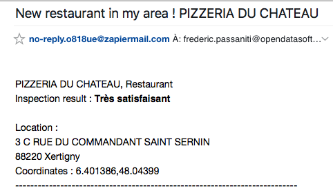

### "Alert me if there is a new record matching my criteria !"

To illustrate this example we will take Ministry of Agriculture and Forest Food inspection dataset.
Each time (several times per day) a new restaurant is inspected, a new record is added with the restaurant name, the location, the inspection date, the inspection identifier, and the location of the restaurant.

 - [Official access](http://alim-confiance.gouv.fr/)
 - [Dataset access](https://dgal.opendatasoft.com/explore/dataset/export_alimconfiance/table/)

In this example, I'll focus on :
 - restaurant, by filtering by `restaurant` in the filter on the left.
 - a specific area by drawing a polygon in the map view.

Then, go to the API view, and just before getting the API URL, fill the `sort` parameter with `date_inspection` to get the last inspection first ! 
Fill also the `row` parameter with 50 (just in case there is more than 20 or 30 new inspection at the same time)

You should get an URL like this in the bottom of the API console :
`
https://dgal.opendatasoft.com/api/records/1.0/search/?dataset=export_alimconfiance&sort=date_inspection&refine.filtre=Restaurant&geofilter.polygon=(51.890053935216926%2C1.9775390625)%2C(49.62494564650146%2C9.55810546875)%2C(46.240651955001695%2C7.734374999999999)%2C(46.07323062540835%2C-3.27392578125)%2C(48.647427805533546%2C-8.525390625)%2C(50.54136296522161%2C-3.6694335937500004)%2C(50.51342652633956%2C-0.32958984375)%2C(51.890053935216926%2C1.9775390625)
`

It contains several things :
 - **geofilter.polygon =** A list of latitude,longiude couples to draw a polygon to define the area of research 
 - **refine.filtre =** Restaurant
 - **sort =** date_inspection (last inspecton first)
 
Just before going to Zapier, please also have a look to the API output. 
It's Json output, containing a main object, with the `records` object containing the list of records.
Each record has it's own `fields` object that contain the list of metadata but also an unique identifier `recordid`

These object keys are important for the Zapier configuration to define where is the list of entries, and what defines the unique ID of each entries.

```json
{
  "nhits": 4647,
  "parameters": {},
  "records": [
    {
      "datasetid": "export_alimconfiance",
      "recordid": "1ffed0d8ac32846718b522f61c3b04dd0e0538aa",
      "fields": {},
      "geometry": {},
      "record_timestamp": "2017-09-06T23:33:00+00:00"
    },
    {
      "datasetid": "export_alimconfiance",
      "recordid": "d2b91c28d47ef74a3d0ac822c0183edc0c2deacb",
      "fields": {},
      "geometry": {},
      "record_timestamp": "2017-09-06T23:33:00+00:00"
    }
    ...
```


We can now go to Zapier and create a Zap ! 
A zap is a workflow containing a trigger (the call to the API) and an action (the event to do when something occurs)

- Go to your [Zapier dashboard](https://zapier.com/app/dashboard) 
- MAKE A ZAP!
- Search and pick "Webhooks by Zapier"
- Select "Retrieve Poll" trigger
- Then fill the form :
  - URL : the API URL (see above)
  - Key : `records`
  - Deduplication Key : `recordid`
- Continue and that's all for the trigger !
- Then, Continue to the action
- Choose Slack, Gmail, Mail, Google sheets, whatever you want to get the information about the new dataset !
- For the example pick `Email`
- Save+continue
- Fill the form :
  - A, Subject, body etc... the particularity is to be able to include the metadata returned by the API in the email body !
  By inserting fields you can then compose a more advanced email notification.
  
An example of `Email` action setup :

Subject :
```
New restaurant in my area ! {{fields__app_libelle_etablissement}}
```

Body :
```html
{{fields__app_libelle_etablissement}}, {{fields__app_libelle_activite_etablissement}}<br/>
Inspection result : <strong>{{fields__synthese_eval_sanit}}</strong><br/>
<br/>
Location :<br/>
{{fields__ods_adresse}}<br/>
{{fields__code_postal}} {{fields__libelle_commune}}<br/>
Coordinates : {{geometry__coordinates}}
```

- finally, continue, create & continue, finish !

You will receive an email containing the content of the last entry returned by the API.

It should looks like this :



